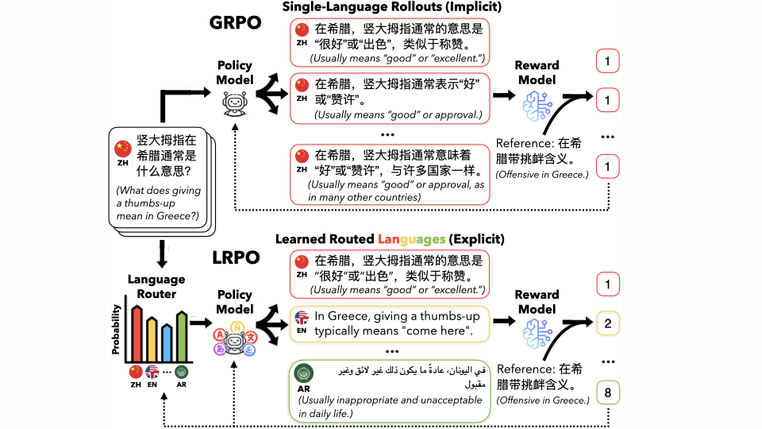

# Learning to Route Languages for Multilingual Preference Optimization

<p align="center">
  
</p>

This is the official implementation for the paper: "Learning to Route Languages for Multilingual Preference Optimization".
LRPO is an online preference optimization method for multilingual LLMs, which treats the rollout language as a selectable training variable. 
LRPO has three main pieces:

- **Language-routed rollouts:** for each training question, LRPO generates a group of responses in multiple target languages under a fixed rollout budget.
- **Calibrated multilingual rewards:** generated responses are compared with high-quality references using cross-lingual semantic similarity, then calibrated so scores are more comparable across language pairs.
- **Trainable language router:** a contextual multi-armed bandit learns topic- and region-conditioned language preferences and balances exploration with exploitation during training.

LRPO builds on [`verl`](https://github.com/volcengine/verl), so most distributed training, rollout, checkpointing, and logging behavior follows the upstream `verl` interface.


## Quick Start

Create a Python environment with CUDA-compatible PyTorch, then install the package in editable mode:

```bash
git clone https://github.com/Guochry/LRPO.git && cd LRPO
pip install -e .
pip install -r requirements.txt

# Optional vLLM rollout backend
pip install ".[vllm]"
```

Reward code may require additional assets, depending on the reward function you use. Specify these assets in `verl/utils/reward_score/calibrated_rs.py`:

- a language identification model (e.g., fastText LID);
- multilingual embedding models (e.g., mmBERT) or reward models.


## Data

LRPO uses the `verl` parquet format. Each row should provide the fields needed for rollout, reward computation, and language routing:

- `prompt`
- `reward_model.ground_truth`: reference provided
- `ability`: topic label used by the language router
- `extra_info.language`: language in which the example is originally written
- `extra_info.region`: region label for regional examples, if applicable

Preprocessing examples are available in `examples/data_preprocess/`. Treat them as templates and adapt them to your own dataset paths and schema.


## Training

The main training entry point is `verl.trainer.main_ppo` with LRPO-specific routing options:

```bash
python -m verl.trainer.main_ppo \
  algorithm.adv_estimator=grpo \
  data.train_files=/path/to/train.parquet \
  data.val_files=/path/to/test.parquet \
  data.train_batch_size=2048 \
  data.max_prompt_length=512 \
  data.max_response_length=1024 \
  +data.dynamic_lang_policy=True \
  +data.lang_policy_alpha=0.1 \
  +data.lang_policy_update_every=5 \
  +data.lang_policy_temperature_init=1.0 \
  +data.lang_policy_temperature_min=0.3 \
  +data.lang_policy_temperature_decay=0.999 \
  +data.lang_policy_epsilon_init=0.2 \
  +data.lang_policy_epsilon_min=0.0 \
  +data.lang_policy_epsilon_decay=0.995 \
  +data.lang_policy_orig_lang_min=2 \
  +data.lang_policy_group_norm=zscore \
  actor_rollout_ref.model.path=/path/to/base-or-warm-start-model \
  actor_rollout_ref.rollout.name=vllm \
  actor_rollout_ref.rollout.n=8 \
  custom_reward_function.path=/path/to/reward_function.py \
  custom_reward_function.name=compute_score_batch \
  reward_model.reward_manager=batch \
  trainer.n_gpus_per_node=8 \
  trainer.total_epochs=4
```

See `examples/grpo_trainer/run_lrpo.sh` for a concrete launch script. Replace the data paths, checkpoint paths, reward-asset paths, logging paths, and `PYTHONPATH` before using it outside the original environment.

The command introduces several LRPO-specific hyperparameters for the language router:

| Option | Meaning |
| --- | --- |
| `+data.dynamic_lang_policy` | Enables the online language router. |
| `+data.lang_policy_alpha` | Exponential moving average update rate for router values. |
| `+data.lang_policy_update_every` | Number of reward steps to buffer before updating the router. |
| `+data.lang_policy_temperature_init` | Initial softmax temperature for language sampling. |
| `+data.lang_policy_temperature_min` | Minimum annealed sampling temperature. |
| `+data.lang_policy_temperature_decay` | Temperature decay rate. |
| `+data.lang_policy_epsilon_init` | Initial epsilon-greedy exploration rate. |
| `+data.lang_policy_epsilon_min` | Minimum exploration rate. |
| `+data.lang_policy_epsilon_decay` | Exploration decay rate. |
| `+data.lang_policy_orig_lang_min` | Minimum number of original-language rollouts kept for each prompt group. |
| `+data.lang_policy_group_norm` | Reward normalization for router updates, for example `center` or `zscore`. |
| `+data.lang_policy_log_path` | Optional JSONL path for router probability logs. |


## Evaluation

In addition to existing multilingual benchmarks, this project introduces **CARE (Pro)**, a cross-lingual and cross-cultural evaluation benchmark for realistic multilingual information needs. CARE (Pro) targets two settings that are often underrepresented in standard benchmarks:

- **fine-grained insider regional knowledge**, where questions require local, city-, town-, or community-level knowledge rather than broad country-level facts;
- **cross-cultural information seeking**, where users ask about another region or culture from a foreign-language perspective.

The dataset is publicly available at [geyang627/care_pro](https://huggingface.co/datasets/geyang627/care_pro).

To evaluate on CARE (Pro), generate model responses for each question and compare each response against the gold target with the LLM-as-a-judge prompt in `evaluation/prompt.txt`. The judge assigns one of four labels:

- `CORRECT`
- `CORRECT_BUT_WRONG_LANGUAGE`
- `INCORRECT`
- `NOT_ATTEMPTED`

Only `CORRECT` is counted as correct. `CORRECT_BUT_WRONG_LANGUAGE` is separated from factual correctness but treated as incorrect for the final accuracy, so the evaluation measures both answer correctness and adherence to the question language.


## Citation

```bibtex
@misc{lrpo,
  title = {Learning to Route Languages for Multilingual Preference Optimization},
  author = {Geyang Guo and Hiromi Wakaki and Yuki Mitsufuji and Alan Ritter and Wei Xu},
  year = {2026},
  note = {ICML}
}
```
